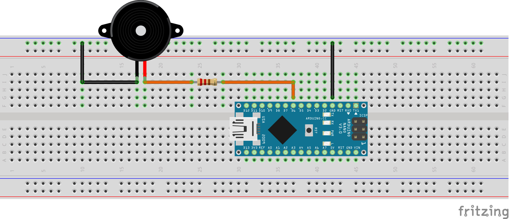
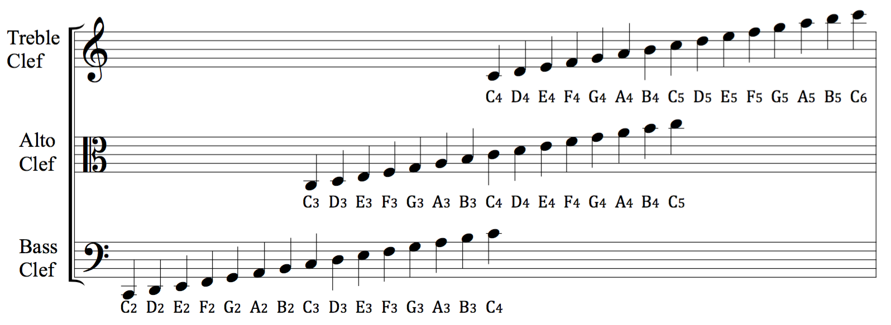

# arduino_christmas_music

This repository is based on the work of [robsoncouto](https://github.com/robsoncouto/arduino-songs). I modified some of their code and added more Christmas songs.

Melodies are generally limited to one or two verses.

The sketches do not rely on any external libraries, only the built-in `tone()` function. It uses pulse width modulation (PWM) to create a square wave at a particular frequency to emulate music notes. Most Arduino boards have several PWM-capable pins. Choose one and remember to define `BUZZERPIN` at the top of the sketch.

You can use an active buzzer, passive buzzer, or speaker. Different components will require different wiring. I used an active buzzer and the wiring is shown below. You must use a current-limiting resistor to avoid drawing too much current from the Arduino's GPIO pin. Larger resistor values will produce a quieter sound. I found a 470 Ω resistor worked best for me but it will depend in part on the component. Anything larger than 220 Ω should be safe to use with an Arduino Uno or Nano.

You can add new songs by translating sheet music and following the pattern in the examples. Since there is only one buzzer you can think of it like playing the piano with one finger. It's important to use simple arrangements that play one note at a time.

Quarter notes are given a value of 4, half notes are 2, and so on. Dotted notes become negative. Use the clef diagram below to translate music.

[Source: Wikipedia](https://en.wikipedia.org/wiki/Clef)
